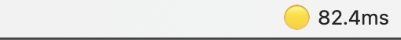

# macbook-ping-menu-bar

A lightweight macOS menu bar application that displays real-time ping status to monitor your network connection.

## Features

- Lives in your macOS menu bar
- Continuously monitors network connectivity
- Shows ping time in milliseconds
- Visual indicators for connection quality
- Minimal resource usage

## Installation

1. Download the latest release from the Releases page
2. Move the app to your Applications folder
3. Launch the app

## Usage

Once launched, the app will appear in your menu bar showing the current ping time to a default server (8.8.8.8). Click the menu bar icon to:

- View detailed ping statistics
- Change target server
- Configure refresh interval
- Quit the application

## Requirements

- macOS 10.15 or later
- Internet connection

## Development

To build from source:

1. Clone this repository
2. Create Python venv and install requirements. 
3. Build and run using `python3 setup.py py2app -A` then `python3 setup.py py2app`
4. App will be created dist folder.   

## Contributing

Contributions are welcome! Please feel free to submit a Pull Request.

## License

MIT License - feel free to use this project as you wish.

## Support

If you encounter any issues or have questions, please open an issue on GitHub.
